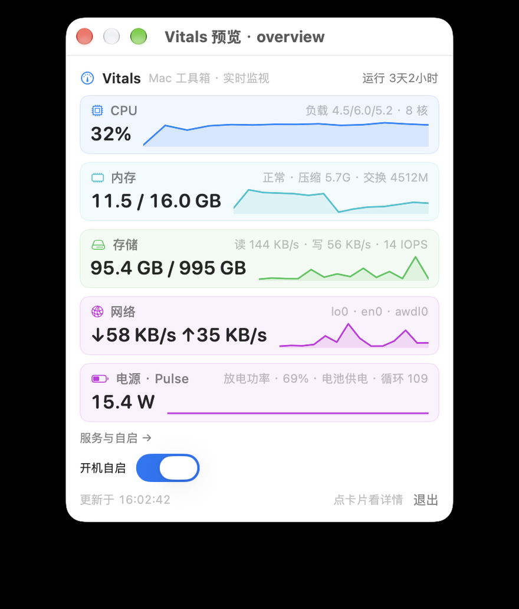
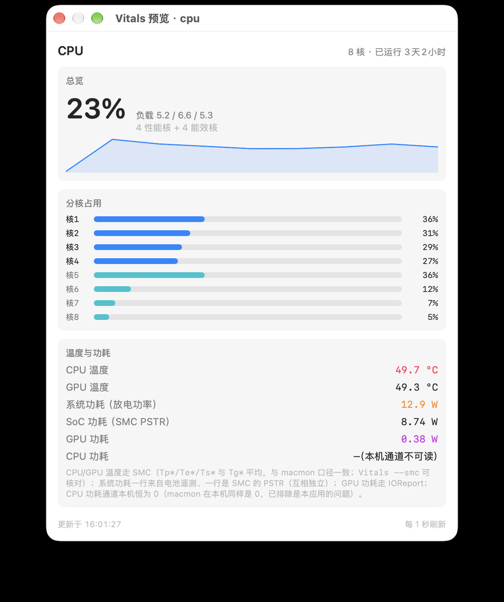
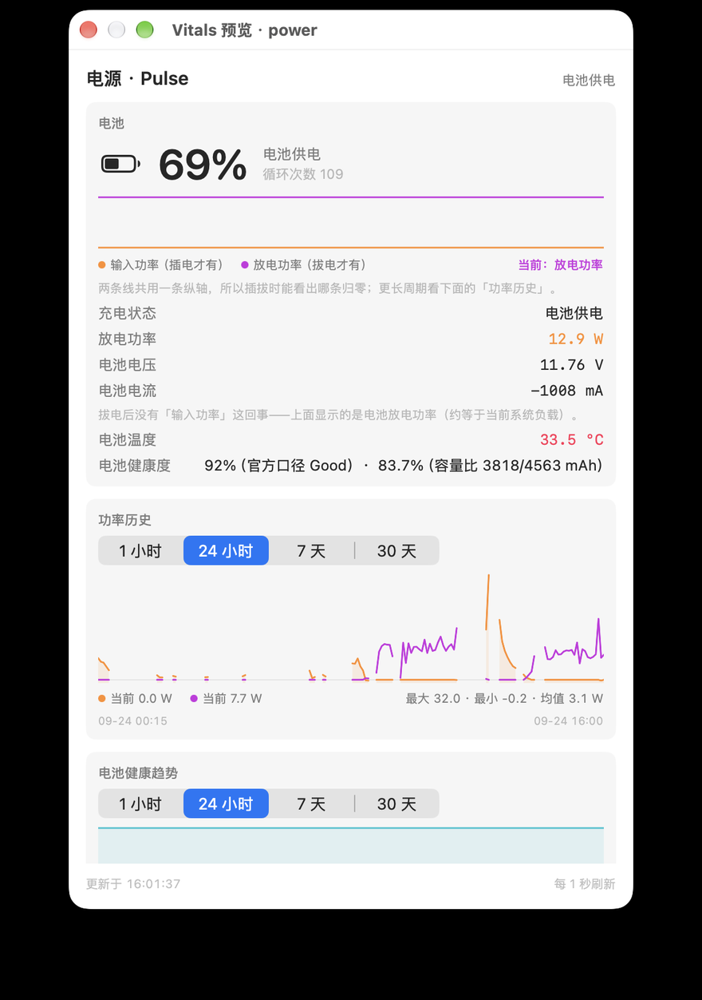
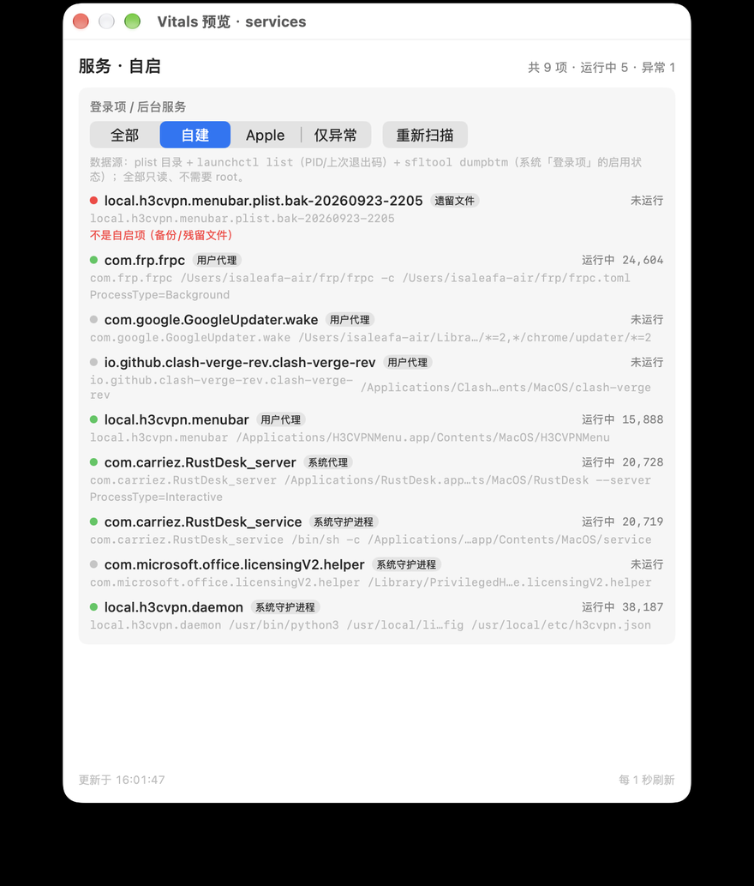

# Vitals

> **macOS 菜单栏上的系统工具箱 + 实时监视器。** 电源、CPU、内存、存储、网络五大实时面板，外加网络体检、SSH 主机可达性、监听端口、登录项审计与阈值告警 —— 全部只读、无需 root、数据不出本机。

> *English:* Vitals is a menu-bar toolbox & real-time system monitor for macOS. Power/charging, CPU, memory, storage, network — plus a one-click network health check, SSH host reachability, listening-port inventory, login-item audit and threshold alerts. Read-only, no root, everything stays local.

<p align="center">
  
</p>

---

## 目录

- [功能](#功能)
- [截图](#截图)
- [安装](#安装)
- [数据来源与已知边界](#数据来源与已知边界)
- [命令行工具](#命令行工具)
- [架构](#架构)
- [隐私](#隐私)
- [开发](#开发)
- [路线图](#路线图)
- [致谢](#致谢)
- [许可与免责](#许可与免责)

---

## 功能

### 菜单栏常驻

- **电池图标**（自绘模板图，细长比例，插电时带闪电）：可以直接替掉系统自带的电池项，把菜单栏位置省下来
- **有告警时自动切换成 ⚠️ 警告三角**，不用点开就知道有问题
- 图标尺寸/形状按系统菜单栏规范打磨，**不额外占用宽度**（改完与系统图标占位一致）

### 总览面板（点菜单栏图标）

五张卡片，每张 = 主数值 + 副信息 + **60 秒迷你曲线**；有告警时面板顶部出现红色横幅、对应卡片变红。点卡片直接进详情页（窗口在**鼠标所在屏幕正中央**打开、强制提到最前）。

| 卡片 | 显示 |
|---|---|
| CPU | 总使用率、负载、核数 |
| 内存 | 已用/总量、压力（正常/警告/严重）、压缩内存、交换 |
| 存储 | 已用/总量、读写速率、IOPS |
| 网络 | 实时上下行、活跃接口 |
| 电源 · Pulse | 接电时=输入功率、拔电时=放电功率（颜色跟着模式变）|

面板底部还有：**服务与自启**入口、**开机自启**开关、退出。

### 五个详情页

| 页面 | 内容 |
|---|---|
| **CPU** | 总使用率曲线、**分核柱状**（性能核/能效核分组着色）、负载与开机时长、进程 TOP、**温度与功耗**（CPU/GPU 温度、系统功耗、SoC 功耗、GPU 功耗）、CPU 温度历史 |
| **内存** | 构成条（已用/压缩/可用）、压力徽标、交换、进程 TOP、内存历史 |
| **存储** | 容量条、实时读写/IOPS、吞吐历史、SMART 摘要（损耗/备用块/温度/通电时长/累计写入）、**NAND 温度** |
| **网络** | **网络体检**（见下）、系统代理层、接口卡（IP/CIDR/MAC/MTU/点对点对端/★默认路由）、**路由表（按接口分组、完整 CIDR、隧道/直连/主机筛选）**、监听端口、SSH 主机、流量历史 |
| **电源 · Pulse** | 电量/状态/循环、输入电压/电流/功率（或放电功率与电池电压电流）、电池温度、健康度（双口径）、适配器（VID/PID/PD 版本）、**支持档位表（当前档位绿点）**、功率历史、**电池健康趋势** |

### 网络一键体检

打开网络页**自动跑一次**，九项逐条出结果（约 3 秒），每项都给通断 + 延迟 + **走哪个接口/代理**：

```
✅ 默认网关          10.0.0.1 · 延迟 3 ms（经 en0）
✅ 内网主机（走隧道）   192.168.1.50 · 延迟 7 ms（经 utun2）
✅ 公网（国内 ping）   223.5.5.5 · 延迟 7 ms（经 en0）
✅ DNS 解析          www.apple.com → 211.95.51.15（8 ms）
✅ 代理 · Google     HTTP 204 · 477 ms（经 127.0.0.1:7897）
✅ 代理 · GitHub     HTTP 200 · 519 ms
✅ 代理 · YouTube    HTTP 200 · 628 ms
✅ 直连 · 百度         HTTP 200 · 234 ms（绕过代理）
✅ 直连 · GitHub     HTTP 200 · 464 ms（绕过代理）
```

内网探测目标默认是示例地址 `192.168.1.50`，改成你自己的：
`defaults write top.liyi830.vitals intranetHost 192.168.10.50`（改完立刻生效）

「代理」三项专门用来确认**代理链路是否工作**（这些站直连本就不通，只有代理正常才通），「直连」两项作对照。

### 其他

- **SSH 主机可达性**：读 `~/.ssh/config`（Host/HostName/User/Port/**ProxyJump**），并发探测 8 台、毫秒级延迟；**配了跳板的条目走 `ssh -J` 端到端探测**（直接 TCP 探测这类条目会误报）
- **登录项 / 后台服务审计**：plist 目录 + `launchctl`（PID/上次退出码）+ **`sfltool dumpbtm`**（系统「设置 → 登录项」的启用状态），标出"曾异常退出 / 已被禁用 / 残留备份文件"
- **监听端口**：`lsof` 按进程归并，默认只显示自建/已知服务（Clash 内核、FRP、h3cvpn、SSH…），避免被系统进程淹没
- **历史与曲线**：每分钟 1 条落盘，支持 **1 小时 / 24 小时 / 7 天 / 30 天** 四档；x 轴按真实时间、**数据缺口自动断线**（应用没运行/机器在睡觉不会画出假线）；睡眠唤醒会重置差分基线（无假尖峰）
- **阈值告警（轻量）**：CPU 持续 ≥90% 满 30 秒 / 内存压力 = 严重 / 磁盘可用 <8% / 电池健康 5 天内掉 ≥2 点。**只在真异常时提示**，不做日常播报
- **开机自启**：走 macOS 13+ 的 `SMAppService`（正规登录项，系统设置里可见可关）；被系统拒绝时自动退回 LaunchAgent

## 截图

> 网络页的截图涉及真实内网地址，这里不放了——本地跑一下就能看到。

| | |
|---|---|
|  |  |
| **CPU**：分核占用、进程 TOP、温度与功耗 | **电源 · Pulse**：档位表、健康度双口径、健康趋势、功率历史 |
|  | |
| **服务 · 自启**：登录项与后台服务审计 | |

## 安装

### 要求

- **macOS 14 或更高**（开发与实测环境：macOS 27 / Apple M2）
- **Apple Silicon**（Intel 未测试；温度/功耗走的是 Apple Silicon 的 SMC/IOReport 通道）
- 构建**只需要 Command Line Tools，不需要完整 Xcode**

### 下载安装（不用编译）

到 [**Releases**](https://github.com/isaleafa/Vitals/releases) 下载最新的 `Vitals-0.1.0.dmg`，打开后把 **Vitals.app** 拖进 **Applications**。

> ⚠️ **首次打开会被 Gatekeeper 拦下**：本 App 是 **ad-hoc 签名**（开源项目没有付费的 Apple 开发者账号做公证），双击只会看到「Apple 无法检查其是否包含恶意软件」——在 macOS 26/27 上这是**直接拒绝启动**，不是给个提示让你点继续。放行方式三选一：
>
> **① 图形方式**（推荐）：先双击一次让它被拦 → 打开「**系统设置 → 隐私与安全性**」→ 下拉到「安全性」区域 → 点「**仍要打开**」→ 输入密码确认。
>
> **② 终端一条命令**：
> ```bash
> xattr -dr com.apple.quarantine /Applications/Vitals.app
> ```
>
> **③ 干脆用终端下载安装**（`curl` 不会打隔离属性，所以完全不触发 Gatekeeper）：
> ```bash
> curl -L -o /tmp/Vitals.dmg https://github.com/isaleafa/Vitals/releases/download/v0.1.0/Vitals-0.1.0.dmg
> hdiutil attach /tmp/Vitals.dmg
> ditto "/Volumes/Vitals 0.1.0/Vitals.app" /Applications/Vitals.app
> hdiutil detach "/Volumes/Vitals 0.1.0"
> open /Applications/Vitals.app
> ```

> **必须从 `/Applications` 运行**：macOS 27 的菜单栏机制（以及 Hidden Bar 这类工具）只认 `/Applications` 里的副本；从别处启动的菜单栏 App 会被判成"认不出来的 App"，收起菜单栏时被隐藏。

### 从源码构建

```bash
git clone git@github.com:isaleafa/Vitals.git vitals
cd vitals

./scripts/build.sh    # 编译 + 生成应用图标 + 打包成 build/Vitals.app
./scripts/run.sh      # 编译 + 装到 /Applications + 重启（就是上面那条"必须从 /Applications 运行"）
./scripts/package.sh  # 打成可分发的 DMG（会自动挂载回来自检）
```

### 首次使用

- **不需要授予任何权限**：所有数据读取（IOKit / Mach / sysctl / getifaddrs / launchd）都不触发系统授权弹窗
- 想开机自启：点面板里的「开机自启」开关；它会出现在「系统设置 → 通用 → 登录项」里，随时可关
- 如果你用 **Hidden Bar** 之类的菜单栏管理器：按住 ⌘ 把 Vitals 图标拖到折叠箭头右侧即可常显（新装的图标默认落在隐藏区）

## 数据来源与已知边界

Vitals 不装驱动、不调 `sudo`，数据全部来自系统自带接口。下表是**实测过**的来源（macOS 27 / M2）：

| 指标 | 来源 |
|---|---|
| CPU 总/各核 | Mach `host_processor_info` |
| 内存 / 压力 / 交换 | `host_statistics64` + `sysctl` |
| 磁盘容量 / 读写 / IOPS | `statfs` + IOKit `IOBlockStorageDriver` 计数器 |
| 磁盘健康 | `smartctl`（存在时；无需 sudo） |
| 网络接口 / 计数器 | `getifaddrs`（注意 32 位计数器回绕）|
| 路由表 | `netstat -rn`（原生实现可换 `sysctl NET_RT_DUMP`）|
| 电池 / 充电器 / PD 档位 | IOKit `AppleSmartBattery`（`AdapterDetails.UsbHvcMenu`、`PowerTelemetryData`…）|
| PD 身份（厂商 VID / PD 版本）| IORegistry `IOPortTransportComponentCCUSBPDSOP` |
| **CPU/GPU 温度** | **SMC**（`Tp*/Te*/Ts*`、`Tg*`）+ IOHIDEventSystem（电池/NAND）|
| **GPU 功耗** | **IOReport**（"Energy Model" 组的差分样本）|
| 系统功耗 / SoC 功耗 | 电池遥测（整机）/ SMC `PSTR`（芯片部分）|
| 登录项 / 后台服务 | plist 目录 + `launchctl` + `sfltool dumpbtm` |

### 已知边界（诚实版）

- **CPU 功耗**在部分机型上读不到（IOReport 的 CPU 能量通道恒 0）。已用 [macmon](https://github.com/vladkens/macmon) 交叉验证：**它在同一台机器上同样是 0**，属机器/系统层面的通道特性，不是本应用的问题。界面会如实显示「—（本机通道不可读）」而不是编个数字
- **GPU 温度**依赖机型是否有对应传感器；没有就显示「—」
- **电池健康度有两个口径**（系统报告的「最大容量」与「当前满充/设计容量」），两者可能相差几个百分点，Vitals 两个都显示并标注来源
- **适配器型号名**：系统只给 VID/PID 与功率，产品名需要自建 VID 库（本项目按需自行选择不做）
- 温度/功耗依赖**私有接口**（IOReport / IOHIDEventSystem / SMC），系统更新后可能失效；设计上失败即整块隐藏，不报错、不影响其他功能
- 这类读取方式**无法上架 Mac App Store**，本项目面向自用与开源分发

## 命令行工具

同一个二进制带一整套自检命令，便于排查与脚本化：

| 命令 | 作用 |
|---|---|
| `Vitals --dump` | 打印一帧完整 JSON 快照（用于对账） |
| `Vitals --bench [N]` | 逐 Provider 测采集耗时 |
| `Vitals --sensors` | 列出全部温度传感器（名字 + 温度）|
| `Vitals --smc` | SMC 温度键（CPU/GPU 分组，与 macmon 口径一致）|
| `Vitals --energy` | IOReport 功耗读数 |
| `Vitals --ports` | 监听端口清单 |
| `Vitals --check-network` | 网络体检九项 |
| `Vitals --ssh` | SSH 主机可达性 |
| `Vitals --launch-items` | 登录项 / 后台服务审计 |
| `Vitals --alerts` | 阈值告警的瞬时条件评估 |
| `Vitals --login-item on\|off` | 开关开机自启 |
| `Vitals --open <page>` | 直接打开某个详情页（cpu/mem/disk/net/power/services）|
| `Vitals --preview <page>` | 把页面开成固定位置的窗口（开发截图用）|

## 架构

```
Sources/
├── App/          VitalsApp.swift        菜单栏场景、命令行入口
├── Core/
│   ├── Sampler.swift                    1 秒采样引擎（主线程毫秒级 + 后台队列跑重活）
│   ├── DiffEngine.swift                 差分/回绕/唤醒重置
│   ├── AppState.swift                   唯一数据源（@Published 快照 + 历史缓冲）
│   ├── History.swift                    分钟级落盘 + 1h/24h/7d/30d 聚合
│   └── Providers/                       CPU / 内存 / 磁盘 / 网络 / 路由 / 电源 / PD 身份
│                                        SMC / HID 温度 / IOReport 功耗 / 进程 / SMART
│                                        / 网络体检 / SSH / 监听端口 / 登录项
└── UI/           总览面板 + 六个详情页 + 迷你曲线/历史图 + 自绘菜单栏图标
```

几条关键设计：

- **分层采样**：主线程只做毫秒级原生调用（实测单帧 0.27ms）；一切要开子进程或遍历大树的活儿（`lsof`/`netstat`/`ps`/`smartctl`/SMC 键枚举）走后台串行队列，算完回主线程赋值
- **按需采样**：进程 TOP、路由表、SMART、登录项审计等只在对应页面打开时采，常态开销 **≈0.6% CPU / 20MB 内存**
- **差分引擎**统一处理"两次采样取差"：CPU%、磁盘/网络速率、功耗都是差值；含 32 位计数器回绕保护与睡眠唤醒重置
- **菜单栏图标自绘**（`NSImage` + `isTemplate`）：SwiftUI 会把 `Image(systemName:)` 还原成符号名并按系统默认尺寸渲染，尺寸/配色修饰全部失效——要"细长/告警态"只能自己画

> 完整的实现方案、数据源规格、里程碑与 **30 条实测坑清单**（macOS 27 上的私有 API、菜单栏、launchd、SMC 字节序等）都在 [`PLAN.md`](PLAN.md) 里。

## 隐私

- **不联网、无遥测、无账号**：所有数据来自本机系统接口，只在本机显示
- 历史数据只写 `~/Library/Application Support/Vitals/history/*.jsonl`（保留 30 天，自动清理），删除该目录即清空全部记录
- 应用不需要任何系统权限（唯一例外是你主动开启的「开机自启」登录项）

## 开发

```bash
./scripts/build.sh                     # 编译 + 打包（含图标生成）
./scripts/run.sh                       # 编译 + 安装到 /Applications + 重启
./scripts/package.sh                   # 打成 DMG（挂载回来自检后输出到 build/Vitals-<版本>.dmg）
./scripts/build.sh && build/Vitals.app/Contents/MacOS/Vitals --dump   # 只对账数据
```

- 图标由 `scripts/make-icon.swift` 生成（纯代码画 → `.iconset` → `.icns`），`build.sh` 会自动调用
- 调试界面：`--preview <page>` 开普通窗口，配合 `screencapture -x -l <窗口号>` 按窗口截图（不受前后层级/屏幕布局影响）
- 无 Xcode 构建的注意事项（缺 `SwiftUIMacros` 时不能用 `@State`、`@main` 要配 `-parse-as-library` 等）见 `PLAN.md` 附录
- **发版**：改 `scripts/build.sh` 里的版本号 → commit → 打个 `v*` 标签推上去，`.github/workflows/release.yml` 会在 macOS runner 上自动构建 DMG 并在 Releases 建好条目（本地也可以直接 `./scripts/package.sh` 然后手动 `gh release create`）

## 路线图

已完成：电源面板、CPU/内存/存储/网络详情、历史曲线、开机自启、应用图标、网络体检、监听端口、SSH 可达性、温度与功耗、登录项审计、电池健康趋势、阈值告警。

待做（打磨项）：

- [ ] `⌘C` 复制任意数值
- [ ] 历史曲线导出 CSV / PNG
- [ ] 更完整的设置界面（采样间隔、菜单栏显示项、历史保留天数）
- [ ] DMG / Homebrew 分发
- [ ] 温度/功耗在更多机型上的可用性核对（欢迎贴 `Vitals --sensors` 输出）

## 致谢

- **[macmon](https://github.com/vladkens/macmon)** —— 本项目在 Apple Silicon 私有通道（IOReport 功耗、IOHIDEventSystem 温度、SMC 键）上的实现参考与**对照仪器**；`macmon pipe` / `macmon debug` 是排查这些通道最有效的工具
- 参考物 **PowerMaster** 的充电详情面板（界面与信息密度的灵感来源）
- [Hidden Bar](https://github.com/dwarvesf/hidden) 的源码与文档（澄清了 macOS 27 菜单栏的一大堆行为）

## 许可与免责

MIT License，见 [LICENSE](LICENSE)。

> **免责声明**：Vitals 通过 Apple **未公开**的接口（IOReport、IOHIDEventSystem、SMC、IORegistry）读取温度与功耗，这类接口可能随系统更新而失效或改变行为。本项目按"自用工具"设计与测试，不保证在所有机型/系统版本上工作；使用风险自负。所有操作均为只读，不修改系统状态。
